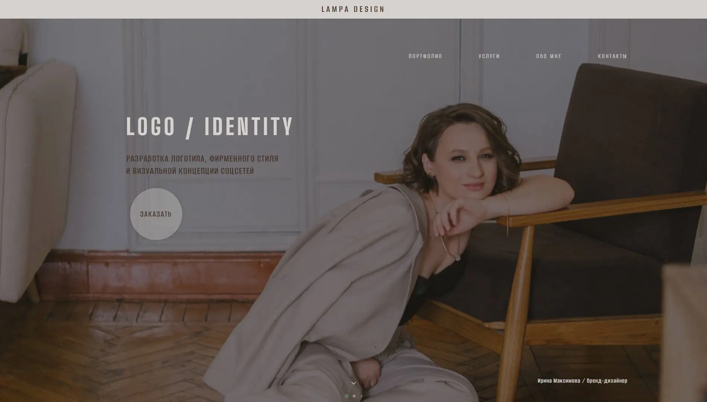
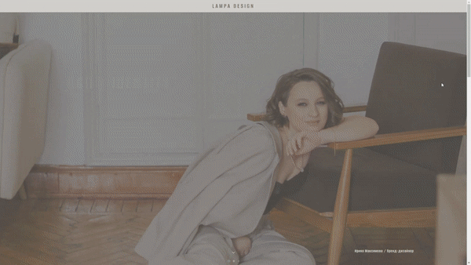
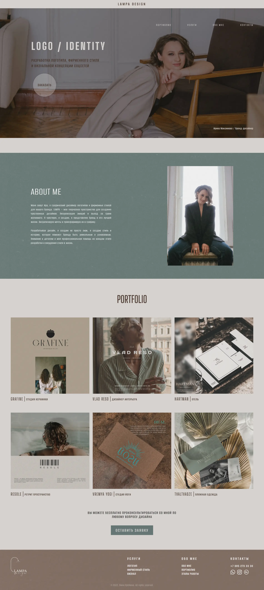

<h1 align="center">Веб-сайт LAMPA DESIGN</h1>

***

<h2 align="center"><a  href="https://design-lampa.ru">design-lampa.ru</a></h2>

***
## Описание

Коммерческий проект, в котором я участвовала, был веб-сайтом для графического дизайнера логотипов и фирменных стилей. Основная цель проекта заключалась в создании визуально привлекательной и удобной платформы для дизайнера, чтобы показать свое портфолио и услуги потенциальным клиентам.

- [Используемые технологии](#technologies)
- [Особенности](#features)
- [Проблемы](#challenges)
- [Результаты](#results)
- [Скриншоты](#screenshots)
- [Вывод](#conclusion)

***

## <a id = "technologies">**Используемые технологии**</a>

- **Webpack** играет основную роль сборщика **HTML/SCSS/JS** файлов
- **GULP** вспомогательный сборщик для автоматизации задач
- Препроцессор **SASS** для эффективного и поддерживаемого стиля **CSS**
- Методология **BEM** для структурирования **HTML** и **CSS** и лучшей читаемости
- Библиотеки **JavaScript**, такие как **AOS** для анимации прокрутки и **Swiper** для создания плавных и отзывчивых слайдеров
- Адаптивная и кроссбраузерная верстка
- Функции прогрессивных веб-приложений (**PWA**) для улучшения взаимодействия с пользователем и повышения доступности веб-сайта в автономном режиме

***

## <a id = "features">**Особенности**</a>

- Полностью адаптивный дизайн для обеспечения оптимального просмотра на любом устройстве
- Привлекательная анимация, делающая веб-сайт более привлекательным
- Удобная навигация, позволяющая пользователям легко находить необходимую им информацию
- Раздел портфолио для демонстрации работ дизайнера
- Контактная форма, позволяющая пользователям легко связаться с дизайнером

***

## <a id = "challenges">**Проблемы**</a>

- Внедрение функций PWA и обеспечение того, чтобы веб-сайт был полностью функциональным в автономном режиме
- Обеспечение полной адаптивности веб-сайта и кроссбраузерной совместимости
- Создание визуально привлекательного дизайна, который эффективно демонстрирует работу дизайнера.

***

## <a id = "results">**Результаты**</a>

Веб-сайт был хорошо принят клиентом и пользователями и стал отличным дополнением к портфолио дизайнера. 

Адаптивный дизайн и удобная навигация облегчают пользователям поиск необходимой им информации, а раздел портфолио эффективно демонстрирует работу дизайнера. 

Внедрение функций PWA также обеспечило полную функциональность веб-сайта в автономном режиме, что сделало его более доступным для пользователей.

***

## <a id = "screenshots">**Скриншоты**</a>

- PC 
- Tablet 
- Mobile

***

## <a id = "conclusion">**Вывод**</a>

Этот проект был интересной возможностью применить мои навыки в веб-разработке и улучшить понимание интерфейсных технологий. Я горжусь конечным результатом и тем положительным влиянием, которое он оказал на бизнес дизайнера.

